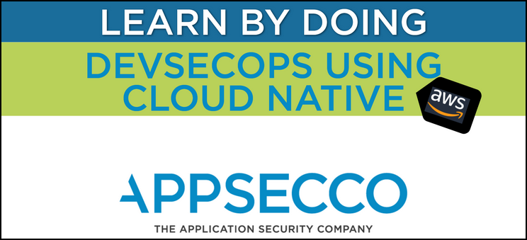

# DevSecOps using CloudNative in AWS nullcon2020



- [Artefacts](artefacts/README.md)
- [Book](book/README.md)

## Running the workshop documentation locally

### Using Python 2 

```bash
cd book/
python -m SimpleHTTPServer
```

### Using Python 3

```bash
cd book/
python3 -m http.server
```

### If you prefer node

```bash
sudo npm install -g http-server
cd book/
http-server
```
